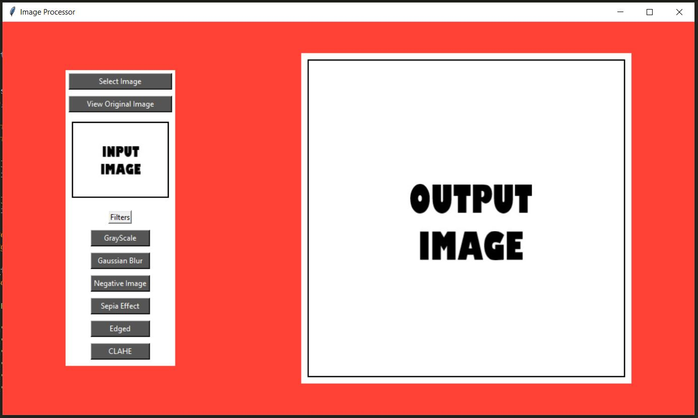
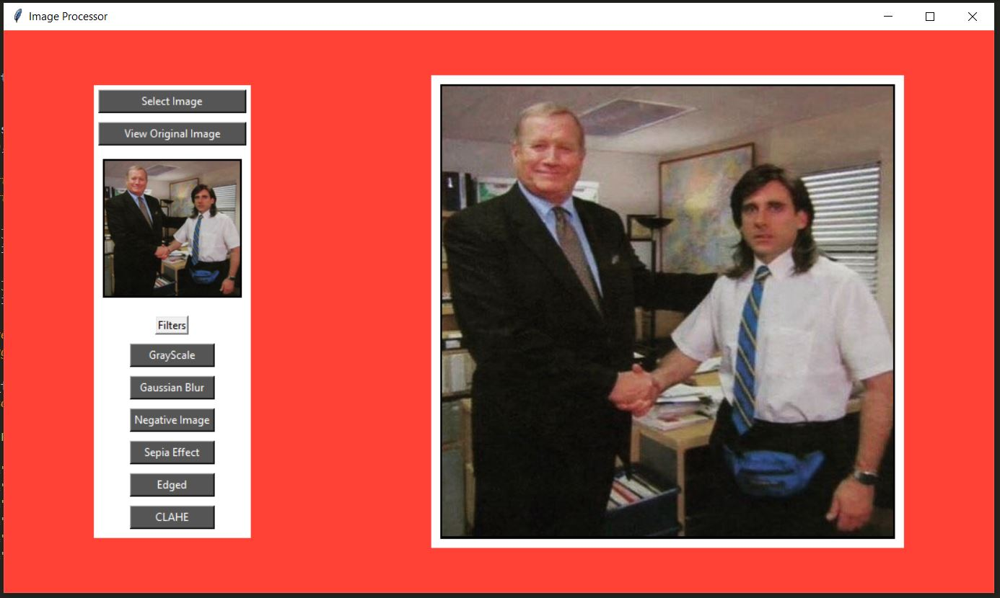
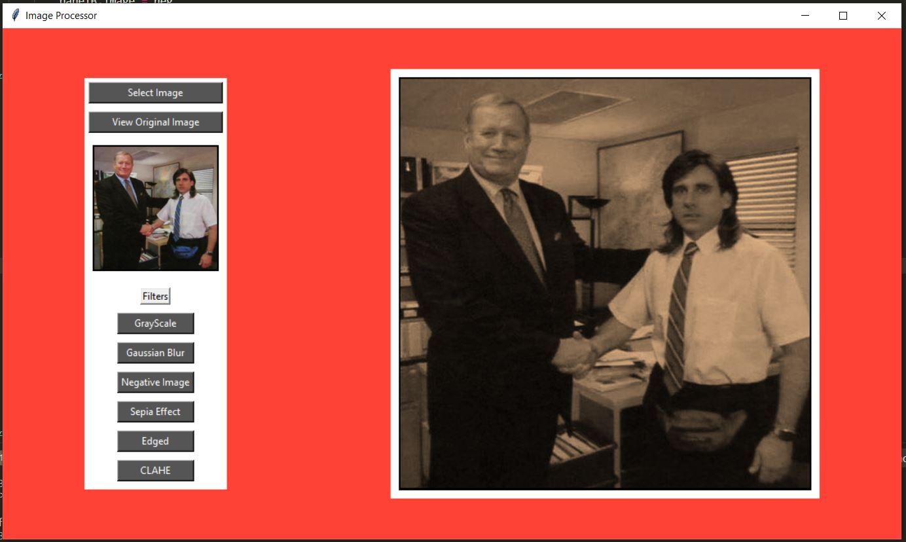

# Image Processing Application

A Python Application to add filters to images. It has a Tkinter based GUI and allows the user to add OpenCV filters such as Grayscale, Gaussian Blur, Negative, Sepia, Edged and Contrast Limited Adaptive Histogram Equalization.

## Working of the Application

1. The initial screen displays where the input and output images will be displayed. The option to choose an image is in the top left corner.

2. When the image is chosen, it is displayed on both the input and output panels, since no effect is chosen yet.

3. As the user switches between the effects, the image on the output panel changes. The user also has the option to view the original image by clicking the button below the select image option.

Here, the Sepia effect is used for the example

